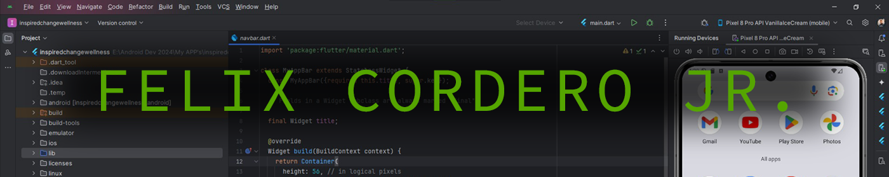

<html>
<head>
</head>
<body>

<h3 id="#about" style="color:white; padding-top:25px; padding-bottom:25px;">About Felix:</h3>

<break>

<h3 id="#languages" style="padding-top:25px; padding-bottom:25px; background-color:black; color:white;">Languages, Tools, and Skills: 🛠</h3>

<h3 style="color:white;">CMS, Hosting and Servers:</h3>

<!--
**Felix-Cordero/Felix-Cordero** is a ✨ _special_ ✨ repository because its `README.md` (this file) appears on your GitHub profile.

Here are some ideas to get you started:

- 🔭 I’m currently working on ...
- 🌱 I’m currently learning ...
- 👯 I’m looking to collaborate on ...
- 🤔 I’m looking for help with ...
- 💬 Ask me about ...
- 📫 How to reach me: ...
- 😄 Pronouns: ...
- ⚡ Fun fact: ...
-->
</body>
</html>